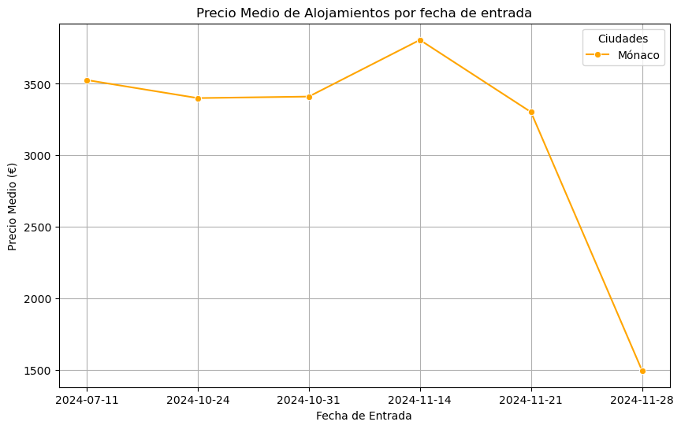
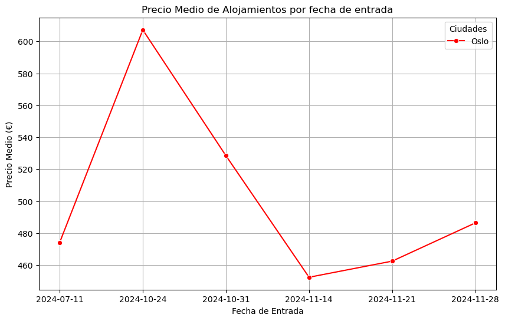

# 🏖️ Proyecto3 - Explorando Viajes 🌍

Este proyecto tiene como objetivo planificar un viaje de fin de semana para un grupo de 4 amigos interesados en hacer turismo en dos destinos posibles: Oslo y Mónaco. El grupo está disponible para viajar durante la última semana de octubre o cualquier fin de semana de noviembre, y ha solicitado una lista de 60 actividades turísticas variadas para disfrutar durante su estancia.

## Descripción del Proyecto 🛫

El proyecto se centra en la recolección y análisis de datos sobre vuelos, alojamientos y actividades turísticas para ambos destinos. Se ha utilizado una combinación de APIs y técnicas de web scraping para obtener información actualizada y detallada sobre:

- Vuelos: Precios, horarios y duración de vuelos de ida y vuelta.
- Alojamientos: Precios y disponibilidad de alojamientos en Mónaco y Oslo (Airbnb).
- Actividades: Se ha recopilado una lista de 60 actividades variadas en cada ciudad para ofrecer una experiencia turística completa.

## Estructura del Proyecto 🗂️

```bash
Proyecto3-Explorando-Viajes/
├── datos/               # Datos crudos y procesados
│   ├── vuelos/          # Información sobre vuelos a Mónaco y Oslo
│   ├── alojamientos/    # Datos de alojamientos Airbnb en ambos destinos
│   ├── actividades/     # Listas de actividades turísticas en Oslo y Mónaco
│   ├── html_backups/    # Html Descargados para hacer beautiful Soup
│   ├── json_backups/    # Jsons descargados para no saturar la API
│   ├── anaconda_prereq/ # Pequeña documentación sobre la creación de Anaconda
├── jupyter_notebooks/   # Notebooks Jupyter con el análisis y las visualizaciones
├── src/  
│    ├── png/            # Fotos de las gráficas
└── README.md            # Descripción del proyecto
```
## Instalación y Requisitos 🛠️
### Requisitos
Para ejecutar este proyecto, asegúrate de tener instalado lo siguiente:

- Python 3.x 🐍
- Jupyter Notebook 📓
- Bibliotecas de Python:
    - [pandas](https://pandas.pydata.org/docs/) para manipulación de datos 🧹
    - [numpy](https://numpy.org/doc/2.1/) para cálculos numéricos 🔢
    - [selenium]()
    - [matplotlib](https://matplotlib.org/stable/index.html)
    - [seaborn](https://seaborn.pydata.org/) para visualización de datos 📊
    - [requests](https://requests.readthedocs.io/en/latest/)
    - [beautifulsoup4](https://beautiful-soup-4.readthedocs.io/en/latest/) para scraping de sitios web 🌐
- API de [Air Scraper](https://rapidapi.com/apiheya/api/sky-scrapper)

### Instalación 🛠️

1. Clona este repositorio y navega al directorio del proyecto:
```bash
git clone https://github.com/tuusuario/Proyecto3-Explorando-Viajes.git
cd Proyecto3-Explorando-Viajes
```
## Gráfica de Precios de Alojamientos 🏡

El siguiente gráfico muestra la evolución de los precios medios de los alojamientos (Airbnb) por fecha de entrada en Mónaco y Oslo. Esta información es clave para que los viajeros elijan la opción que mejor se adapte a su presupuesto:




## Conclusiones ✈️

Este análisis ha permitido:

1. Ofrecer dos opciones de destinos turísticos (Oslo y Mónaco) con datos completos sobre vuelos, alojamientos y actividades.
2. Visualizar y comparar los precios medios de alojamientos para diferentes fines de semana.
3. Proporcionar al grupo de amigos una experiencia de viaje personalizada con 60 actividades seleccionadas según sus intereses.

# Contribuciones 🤝

Las contribuciones a este proyecto son muy bienvenidas. Si tienes alguna sugerencia, mejora o corrección, no dudes en ponerte en contacto o enviar tus ideas.

Cualquier tipo de contribución, ya sea en código, documentación o feedback, será valorada. ¡Gracias por tu ayuda y colaboración!

# Autores y Agradecimientos ✍️

## Autor ✒️
**Gonzalo Ruipérez Ojea** - [@apelsito](https://github.com/apelsito) en github

## Agradecimientos
Quiero expresar mi agradecimiento a **Hackio** y su equipo por brindarme la capacidad y las herramientas necesarias para realizar este proyecto con solo una semana de formación. Su apoyo ha sido clave para lograr este trabajo.