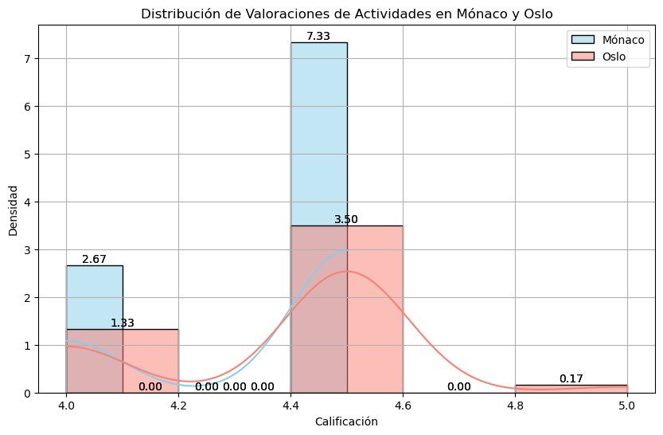
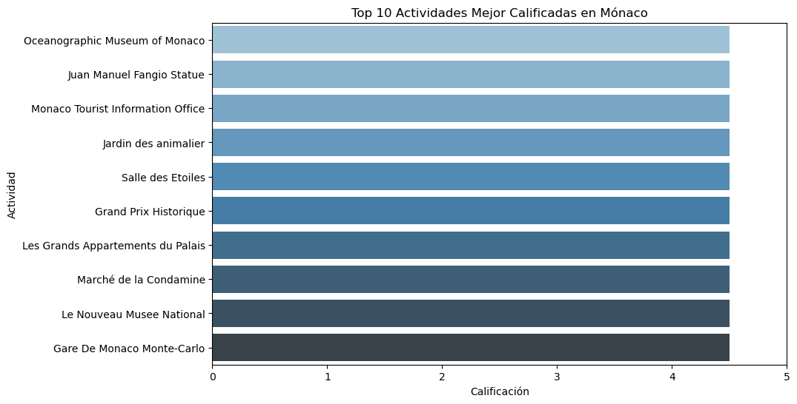
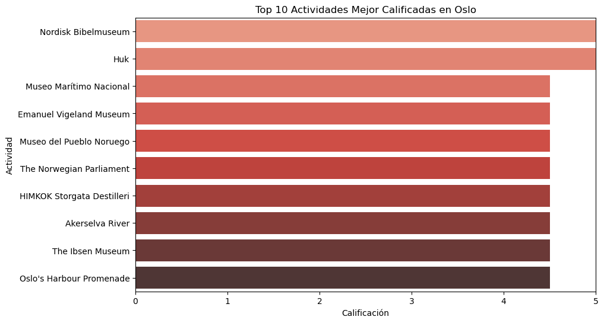
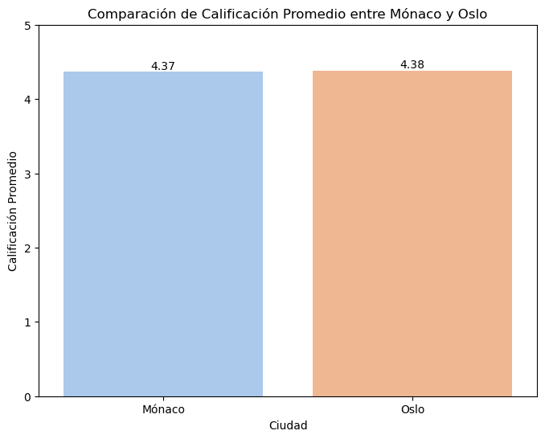
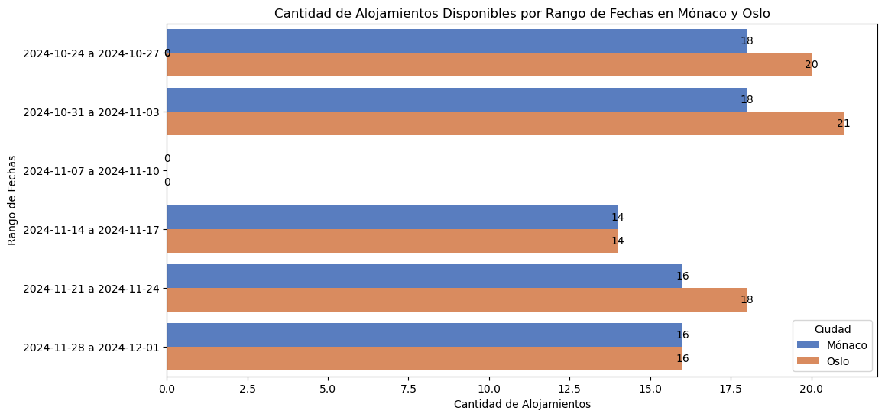
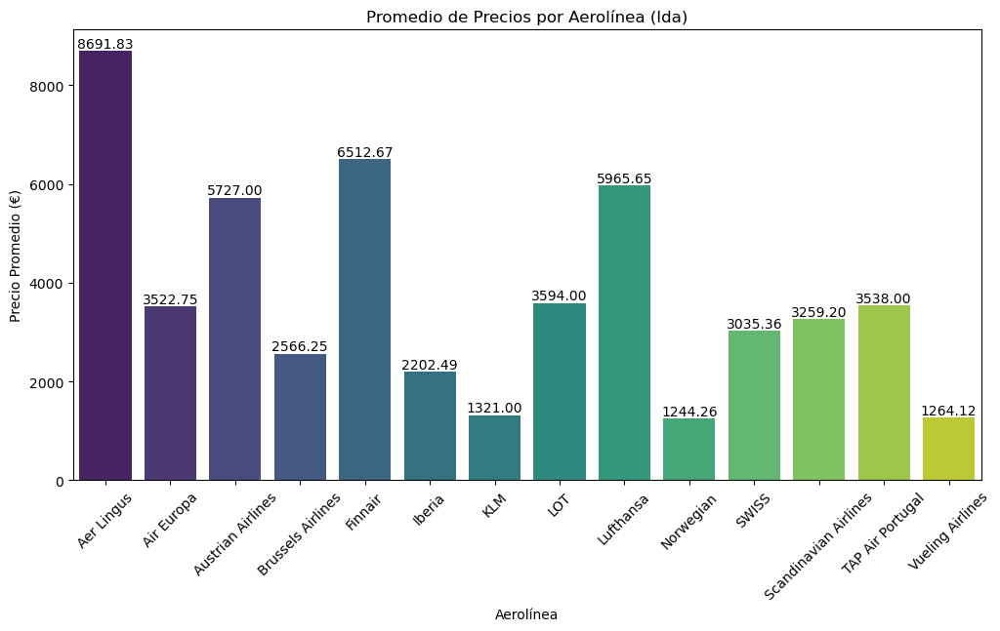
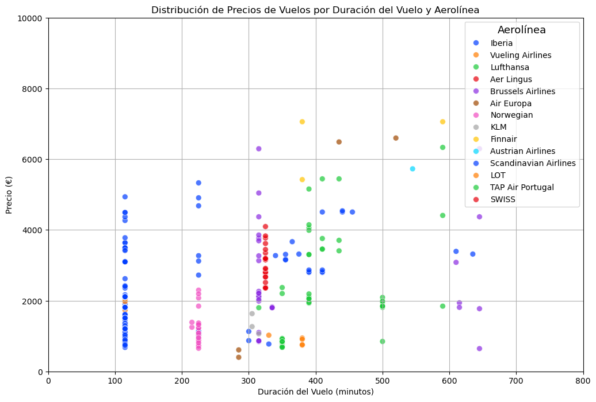

# 🏖️ Proyecto3 - Explorando Viajes 🌍

Este proyecto tiene como objetivo planificar un viaje de fin de semana para un grupo de 4 amigos interesados en hacer turismo en dos destinos posibles: Oslo y Mónaco. El grupo está disponible para viajar durante la última semana de octubre o cualquier fin de semana de noviembre, y ha solicitado una lista de 60 actividades turísticas variadas para disfrutar durante su estancia.

## Descripción del Proyecto 🛫

El proyecto se centra en la recolección y análisis de datos sobre vuelos, alojamientos y actividades turísticas para ambos destinos. Se ha utilizado una combinación de APIs y técnicas de web scraping para obtener información actualizada y detallada sobre:

- Vuelos: Precios, horarios y duración de vuelos de ida y vuelta.
- Alojamientos: Precios y disponibilidad de alojamientos en Mónaco y Oslo (Airbnb).
- Actividades: Se ha recopilado una lista de 60 actividades variadas en cada ciudad para ofrecer una experiencia turística completa.

## Estructura del Proyecto 🗂️

```bash
Proyecto3-Explorando-Viajes/
├── datos/               # Datos crudos y procesados
│   ├── vuelos/          # Información sobre vuelos a Mónaco y Oslo
│   ├── alojamientos/    # Datos de alojamientos Airbnb en ambos destinos
│   ├── actividades/     # Listas de actividades turísticas en Oslo y Mónaco
│   ├── html_backups/    # Html Descargados para hacer beautiful Soup
│   ├── json_backups/    # Jsons descargados para no saturar la API
│   ├── anaconda_prereq/ # Pequeña documentación sobre la creación de Anaconda
├── jupyter_notebooks/   # Notebooks Jupyter con el análisis y las visualizaciones
├── src/  
│    ├── png/            # Fotos de las gráficas
└── README.md            # Descripción del proyecto
```
## Instalación y Requisitos 🛠️
### Requisitos
Para ejecutar este proyecto, asegúrate de tener instalado lo siguiente:

- Python 3.x 🐍
- Jupyter Notebook 📓
- Bibliotecas de Python:
    - [pandas](https://pandas.pydata.org/docs/) para manipulación de datos 🧹
    - [numpy](https://numpy.org/doc/2.1/) para cálculos numéricos 🔢
    - [selenium](https://selenium-python.readthedocs.io/) Automatización de navegadores para scraping de datos.🌐
    - [matplotlib](https://matplotlib.org/stable/index.html) Visualización gráfica de datos.📊
    - [seaborn](https://seaborn.pydata.org/) para visualización de datos 📊
    - [requests](https://requests.readthedocs.io/en/latest/) Realización de peticiones HTTP para acceder a datos en línea.🌍
    - [beautifulsoup4](https://beautiful-soup-4.readthedocs.io/en/latest/) para scraping de sitios web 🌐
- API de [Air Scraper](https://rapidapi.com/apiheya/api/sky-scrapper) API para obtener información de vuelos y precios.✈️

### Instalación 🛠️

1. Clona este repositorio y navega al directorio del proyecto:
```bash
git clone https://github.com/apelsito/Proyecto3-Explorando-Viajes.git
cd Proyecto3-Explorando-Viajes
```
# Análisis de las Gráficas obtenidas 📊
Para comprender mejor las opciones de viaje a Oslo y Mónaco, se han elaborado una serie de gráficas que ofrecen una visión detallada de los datos de precios y disponibilidad de alojamientos, así como de los vuelos y valoraciones de las actividades.

Estas visualizaciones ayudan a responder preguntas clave sobre la accesibilidad económica y la conveniencia de cada destino para el grupo de amigos, tomando en cuenta fechas específicas de viaje y rangos de precios.

## Distribución de Calificaciones de Actividades en Mónaco y Oslo



En la gráfica de distribución de calificaciones de actividades en Mónaco y Oslo, observamos una tendencia clara hacia valoraciones altas en ambos destinos.
1. Concentración de Calificaciones:

- **La mayoría de las actividades** en ambas ciudades tienen calificaciones altas, situándose entre 4.0 y 4.5. Esto indica una oferta turística de calidad similar en ambos lugares, con actividades generalmente bien valoradas.
- **La densidad más alta** en cada destino está alrededor de la calificación de 4.5, lo que sugiere que los visitantes de ambos destinos suelen encontrar experiencias satisfactorias.
2. Comparación entre Mónaco y Oslo:

- Aunque ambas ciudades tienen una distribución de calificaciones similar, Mónaco muestra una leve mayor concentración en calificaciones justo por encima de 4.0, mientras que Oslo parece estar ligeramente más concentrado en 4.5.
- Esto puede indicar que las actividade de Oslo están ligeramente mejor valoradas en términos de experiencia general.
3. Rangos de Calificación Menores:

- Notamos muy pocas o ninguna actividad en rangos de calificación inferiores a 4.0, lo que sugiere que, en general, las opciones de actividades en ambas ciudades mantienen un estándar de calidad alto.
- Es poco común encontrar actividades turísticas en estos destinos con calificaciones bajas, lo cual es positivo para quienes buscan experiencias confiables y bien valoradas.

## Top 10 Actividades en Mónaco y Oslo




Vemos que en Oslo tenemos dos actividades con una valoración de 5/5 estrellas, esto puede significar que, aunque ambos destinos cuentan con altas valoraciones, si el grupo de amigos busca calidad de las atracciones turísticas, oslo esta gráfica podría ser un factor decisivo.

## Valoración Promedio entre Mónaco y Oslo



1. **Calificaciones Promedio Altas**
- Tanto Mónaco como Oslo presentan calificaciones promedio superiores a 4.0, lo cual refuerza la idea de que ambos destinos ofrecen actividades de calidad que satisfacen a sus visitantes.
2. **Diferencia en la Calificación Promedio**
- Aunque la diferencia entre ambas ciudades es leve, Oslo tiene una calificación promedio ligeramente superior a Mónaco. Lo que sugiere que las actividades en Oslo han recibido una valoración mejor de los visitantes. Lo que puede reflejar experiencias más atractivas o mejor valoradas en Oslo, aunque ambos destinos son muy parecidos en valoración.

## Alojamientos Disponibles por Rango de Fechas en Mónaco y Oslo



La gráfica muestra cómo varía la disponibilidad de alojamientos entre ambos destinos en cada periodo específico.

1. **Comparación de Disponibilidad entre Mónaco y Oslo:**

- En la mayoría de los rangos de fechas, Oslo presenta una ligera ventaja en la cantidad de alojamientos disponibles en comparación con Mónaco. 
- Esto sugiere que Oslo podría tener una oferta de alojamiento ligeramente mayor, lo que puede ser atractivo para los viajeros que buscan más opciones en cuanto a precios o ubicación.

2. **Variabilidad entre Rangos de Fechas:**

- Notamos que la disponibilidad no es constante; algunos periodos, como el de 14 al 17 de noviembre, tienen una menor cantidad de alojamientos en ambas ciudades. 
- Esto podría indicar una baja en la oferta de alojamiento en ciertas fechas o una posible demanda anticipada en otras fechas.

3. **Patrones de Demanda Posible:**

- Las fechas hacia finales de octubre y principios de noviembre **(como el rango del 24 al 27 de octubre y del 31 de octubre al 3 de noviembre)** muestran mayor disponibilidad. 
- Este patrón podría estar asociado a una menor demanda estacional o a que estos periodos no coinciden con festividades importantes.

## Evolución de Precios por Rango de Fechas


1. **Comparación de Precios Promedio:**
- En general, los precios promedio de alojamiento en Mónaco son significativamente más altos que en Oslo. Esto es consistente a lo largo de todos los rangos de fechas, con diferencias bastante notorias.

2. **Tendencias en Mónaco:**
- Los precios en Mónaco muestran variaciones, con un incremento que alcanza un pico en el rango del 7 al 10 de noviembre (3806.14 €).
- Posteriormente, los precios disminuyen, terminando en el rango del 28 de noviembre al 1 de diciembre con un promedio de 1497.12 €.
- Esto podría indicar una fluctuación estacional en la demanda de alojamiento o la disponibilidad de opciones de lujo durante ciertos periodos.

3. **Tendencias en Oslo:**
- Los precios promedio en Oslo se mantienen relativamente estables, sin grandes cambios entre los rangos de fechas. El precio promedio oscila entre 452.36 € y 607.25 €, lo que sugiere una estabilidad en la oferta y demanda de alojamiento en este destino, con opciones más accesibles que en Mónaco.

4. **Conclusión General:**
- Para los viajeros que buscan opciones de alojamiento económico, Oslo sería una mejor opción, especialmente en el contexto de estos rangos de fechas, dada su estabilidad en precios bajos.
- Por otro lado, Mónaco muestra una mayor variabilidad en precios, lo que podría interesar a los viajeros dispuestos a pagar más por experiencias exclusivas, aunque deben tener en cuenta los periodos en los que los precios son más altos.

## Promedio de Precios Por Aerolínea



1. **Aerolíneas con Precios Más Altos:**
- Aer Lingus lidera con una diferencia considerable, alcanzando un precio promedio de aproximadamente 8691.83 €, lo que lo convierte en una opción bastante costosa en comparación con las demás aerolíneas.
- Finnair y Lufthansa también muestran precios elevados, con promedios de 6512.67 € y 5965.65 € respectivamente, situándose en el rango alto de las opciones.
2. **Aerolíneas de Rango Medio:**
- Air Europa, Austrian Airlines, LOT y SWISS ofrecen precios que rondan entre 2500 € y 3500 €. Estas aerolíneas podrían representar un equilibrio entre costo y servicio dependiendo de las preferencias del grupo.
3. **Aerolíneas con Precios Más Bajos:**
- Las opciones más económicas son Norwegian (1244.26 €), Vueling Airlines (1264.12 €) y KLM (1321.00 €), destacándose como alternativas más accesibles para el grupo de amigos, en caso de que la prioridad sea mantener el presupuesto bajo control.

## Duración Promedio del Vuelo por Aerolínea


1. **Duración Extremadamente Alta para Aer Lingus**:
- La duración promedio para Aer Lingus es notablemente alta, con 2116.7 minutos (alrededor de 35 horas).
- Esto podría deberse a vuelos con múltiples escalas o rutas indirectas.
2. **Aerolíneas con Duración Moderada:**
- Algunas aerolíneas, como Austrian Airlines (545 minutos) y LOT (1090 minutos), también tienen duraciones relativamente largas, pero mucho más manejables en comparación con Aer Lingus.
- Estas duraciones sugieren que estas aerolíneas podrían incluir una escala o tener rutas menos directas.
3. **Aerolíneas con Duraciones Cortas:**
- Vueling Airlines y Norwegian tienen las duraciones de vuelo promedio más cortas, con 274.4 y 224.1 minutos respectivamente, lo que sugiere vuelos más directos.
- Esto es ideal para viajeros que buscan reducir el tiempo de viaje.
4. **Variabilidad entre Aerolíneas:**
- El gráfico muestra una amplia variabilidad en la duración promedio según la aerolínea. 
- Esto puede ayudar a los clientes a elegir en función de su preferencia por vuelos más directos (aerolíneas como Vueling y Norwegian) o rutas más económicas que pueden incluir escalas.

## Distribución de Precios de Vuelos por Duración y Clase


1. **Relación entre Precio y Duración:**
- A medida que aumenta la duración del vuelo (en minutos), los precios tienden a incrementarse, especialmente en las clases premium_economy (naranja) y business (verde).
- Esto sugiere que los vuelos de mayor duración suelen ser más costosos, lo cual es previsible debido a factores como la distancia y el confort.
2. **Economy como Opción Económica:**
- La clase economy (azul) se concentra principalmente en precios más bajos, por debajo de los 2,000 €, independientemente de la duración.
- Esto hace que economy sea la opción más accesible para vuelos de distintas duraciones.
3. **Variabilidad en Precios para Clases Premium Economy y Business:**
- Premium economy y business presentan una mayor variabilidad de precios, especialmente entre los 300 y 500 minutos de duración.
- Esto indica que los precios en estas clases son menos predecibles y pueden variar dependiendo de factores específicos de cada vuelo, como la demanda, disponibilidad y servicios ofrecidos.
4. **Picos de Precio en Duraciones Intermedias:**
- Observamos algunos puntos altos en premium_economy y business, alrededor de 4,000 a 8,000 €, en vuelos de 300 a 500 minutos. 
- Esto indica que en vuelos de media distancia, los precios pueden elevarse considerablemente en estas clases, posiblemente debido a rutas específicas o alta demanda.

## Distribución de Precios de Vuelos por Duración y Aerolínea



1. **Variabilidad de Precios por Aerolínea:**
- Algunas aerolíneas, como Iberia (azul) y Norwegian (rosa), muestran precios más accesibles, con la mayoría de sus vuelos por debajo de los 2,000 €.
- Esto sugiere que estas aerolíneas tienden a ser opciones más económicas en diferentes duraciones de vuelo.
- Otras aerolíneas, como Lufthansa (verde) y SWISS (morado), tienen precios más altos en vuelos de duración similar, lo cual puede indicar un enfoque en servicios de mayor calidad o rutas menos directas.
2. **Duración de Vuelo y Precios en TAP Air Portugal:**
- TAP Air Portugal (naranja) muestra varios puntos con precios altos, especialmente en vuelos de mayor duración (alrededor de 500 a 700 minutos).
- Esto sugiere que los vuelos largos de esta aerolínea pueden ser costosos, posiblemente debido a la naturaleza de sus rutas o a una demanda alta.
3. **Aerolíneas con Precios Consistentes en Duraciones Cortas:**
- Vueling Airlines y Scandinavian Airlines muestran precios relativamente consistentes para vuelos de menor duración (menos de 300 minutos)
- Esto indica opciones estables para quienes buscan vuelos más cortos y económicos.
4. **Picos de Precio en Rutas de Duración Media:**
- En vuelos de entre 300 y 500 minutos, aerolíneas como LOT y Lufthansa presentan precios elevados, lo cual puede estar relacionado con la oferta de vuelos de largo alcance en estas compañías.

## Conclusiones ✈️

Este análisis  de datos  ha permitido extraer conclusiones clave que ayudarán al grupo de amigos a elegir la mejor opción para su viaje de fin de semana.

1. **Calidad de las Actividades Turísticas:**
- Tanto Oslo como Mónaco ofrecen actividades turísticas de alta calidad, con la mayoría de las valoraciones situándose entre 4.0 y 4.5 estrellas.
- Sin embargo, Oslo destaca ligeramente en términos de satisfacción de los visitantes, lo cual podría hacer de esta ciudad una elección ideal para aquellos que priorizan experiencias bien valoradas.
2. **Comparación de Alojamientos:**
- Los precios de alojamiento en Mónaco son significativamente más altos y presentan mayor variabilidad en comparación con Oslo, que mantiene precios más accesibles y estables.
- Esto convierte a Oslo en una mejor opción para quienes buscan opciones económicas, mientras que Mónaco puede atraer a viajeros interesados en experiencias de lujo.
3. **Opciones de Vuelo:**
- Existe una gran disparidad en los precios de los vuelos entre diferentes aerolíneas. Las opciones más económicas, como Norwegian y Vueling Airlines, son ideales para el grupo si desean reducir costos.
- Sin embargo, si priorizan la comodidad y están dispuestos a pagar más, pueden considerar aerolíneas como Lufthansa y Swiss, que ofrecen servicios de calidad pero a precios más altos.
- En cuanto a la duración del vuelo, aerolíneas como Vueling y Norwegian destacan por sus vuelos más directos y de corta duración, lo que puede ser una ventaja para quienes buscan optimizar su tiempo de viaje.
4. **Distribución de Precios de Vuelos según Clase:**
- La clase economy es la más asequible para vuelos de distintas duraciones, mientras que las clases premium economy y business muestran una mayor variabilidad de precios y suelen ser más caras, especialmente en vuelos de media distancia. 
- Esto sugiere que economy es la mejor opción para aquellos que buscan precios bajos sin importar la duración del vuelo.
5. **Disponibilidad de Alojamientos por Fecha:**
- Oslo presenta una disponibilidad de alojamientos ligeramente mayor que Mónaco en la mayoría de los rangos de fechas analizados.
- Esto puede ser ventajoso para el grupo si prefieren tener una variedad de opciones de alojamiento para elegir, especialmente en fechas de alta demanda.

### Recomendaciones
En base a este análisis, se recomienda que el grupo de amigos considere los siguientes aspectos al tomar su decisión:

- **Si el presupuesto es una prioridad**, Oslo podría ser la mejor opción debido a su oferta de alojamientos más económicos y vuelos accesibles.
- **Para quienes buscan una experiencia de lujo**, Mónaco ofrece opciones de alojamiento premium y actividades exclusivas, aunque deben tener en cuenta las fechas con precios elevados.
- **Si desean minimizar la duración del viaje**, aerolíneas como Vueling y Norwegian ofrecen vuelos más cortos, lo cual puede optimizar el tiempo de su fin de semana.

# Contribuciones 🤝

Las contribuciones a este proyecto son muy bienvenidas. Si tienes alguna sugerencia, mejora o corrección, no dudes en ponerte en contacto o enviar tus ideas.

Cualquier tipo de contribución, ya sea en código, documentación o feedback, será valorada. ¡Gracias por tu ayuda y colaboración!

# Autores y Agradecimientos ✍️

## Autor ✒️
**Gonzalo Ruipérez Ojea** - [@apelsito](https://github.com/apelsito) en github

## Agradecimientos
Quiero expresar mi agradecimiento a **Hackio** y su equipo por brindarme la capacidad y las herramientas necesarias para realizar este proyecto con solo una semana de formación. Su apoyo ha sido clave para lograr este trabajo.